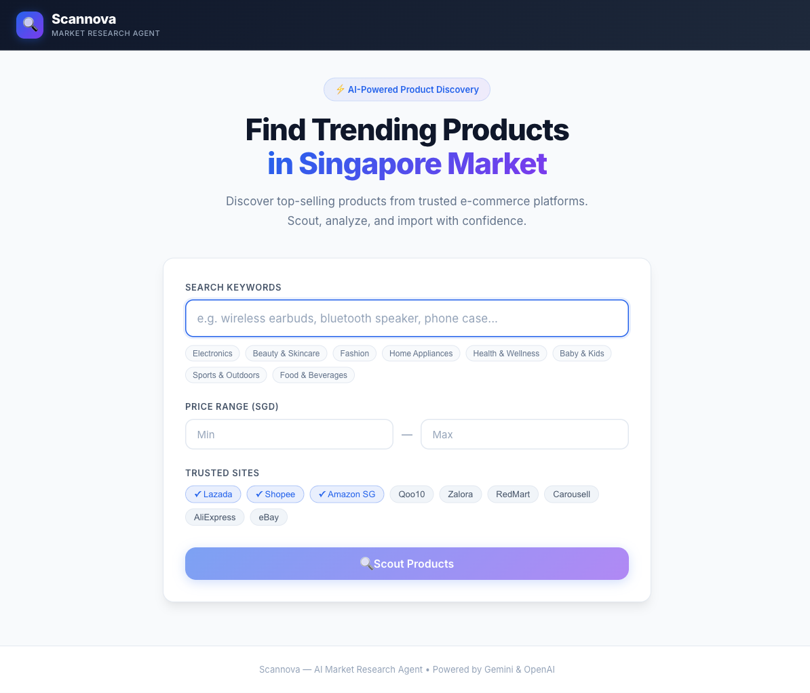

<div align="center">

# Scannova

[](https://react.dev)
[](https://vitejs.dev)
[](https://expressjs.com)
[](https://ai.google.dev)
[](https://openai.com)
[](https://alfredang.github.io/scannova/)

**AI Market Research Agent for E-Commerce Product Discovery in Singapore**

[Live Demo](https://alfredang.github.io/scannova/) · [Report Bug](https://github.com/alfredang/scannova/issues) · [Request Feature](https://github.com/alfredang/scannova/issues)

</div>

## Screenshot



## About

Scannova is an AI-powered market research agent that helps Singapore e-commerce sellers discover trending products, analyze pricing, and identify import opportunities. It searches across trusted regional platforms (Lazada, Shopee, Amazon SG, Qoo10) using live Google Search grounding and returns ranked, exportable results.

### Key Features

- **AI-Powered Search** — Gemini 2.0 Flash with Google Search grounding for live product data
- **Smart Fallback** — Automatic OpenAI GPT-4o-mini fallback when Gemini is unavailable
- **Trusted Sites** — Lazada, Shopee, Amazon SG, Qoo10, and more
- **Price Filtering** — Set min/max price ranges in SGD
- **Product Ranking** — Scored by popularity (sales, reviews, demand signals)
- **CSV Export** — Download results for downstream analysis
- **Premium UI** — Animated, responsive design with live status indicators

## Tech Stack

| Layer        | Technology                          |
|--------------|-------------------------------------|
| Frontend     | React 19 + Vite 8                   |
| Styling      | Vanilla CSS + Inter font            |
| Backend      | Express 5 (Node.js)                 |
| AI (Primary) | Google Gemini 2.0 Flash + Search    |
| AI (Fallback)| OpenAI GPT-4o-mini                  |
| Deployment   | GitHub Pages (frontend) + GitHub Actions |

## Architecture

```
┌──────────────┐     ┌──────────────────┐     ┌─────────────────────┐
│   React UI   │────▶│   Express API    │────▶│ Gemini 2.0 (Primary)│
│  (Vite SPA)  │     │  /api/research   │     │   + Google Search   │
└──────────────┘     └────────┬─────────┘     └─────────────────────┘
                              │                          │
                              │ (fallback on failure)    │
                              ▼                          ▼
                     ┌─────────────────────┐
                     │  OpenAI GPT-4o-mini │
                     └─────────────────────┘
```

> **Note:** The GitHub Pages deployment hosts the React frontend only. To use the AI research features, run the Express backend locally (or deploy it to a Node host such as Render, Railway, or Fly.io) and point the frontend at it.

## Project Structure

```
scannova/
├── .github/workflows/deploy.yml   # GitHub Pages CI/CD
├── server/
│   ├── index.js                   # Express API server
│   └── services/
│       ├── gemini.js              # Gemini API integration
│       ├── openai.js              # OpenAI fallback
│       └── researcher.js          # Orchestrator
├── src/
│   ├── App.jsx                    # Main app component
│   ├── index.css                  # Design system
│   ├── main.jsx                   # React entry
│   └── components/
│       ├── Header.jsx
│       ├── SearchForm.jsx
│       ├── ProductCard.jsx
│       ├── ResultsPanel.jsx
│       └── LoadingState.jsx
├── .env.example                   # API key template
├── package.json
└── vite.config.js
```

## Getting Started

### Prerequisites

- Node.js 20+
- A [Google Gemini API key](https://ai.google.dev)
- (Optional) An [OpenAI API key](https://platform.openai.com) for fallback

### 1. Clone & install

```bash
git clone https://github.com/alfredang/scannova.git
cd scannova
npm install
```

### 2. Configure API keys

```bash
cp .env.example .env
```

Edit `.env`:

```
GEMINI_API_KEY=your_gemini_key_here
OPENAI_API_KEY=your_openai_key_here
```

### 3. Run locally

**Terminal 1 — Backend API:**
```bash
npm run server
```

**Terminal 2 — Frontend:**
```bash
npm run dev
```

Open [http://localhost:5173](http://localhost:5173).

## Deployment

### GitHub Pages (frontend)

This repo ships with a GitHub Actions workflow at [.github/workflows/deploy.yml](.github/workflows/deploy.yml) that builds the Vite SPA and publishes it to GitHub Pages on every push to `main`.

Live site: **https://alfredang.github.io/scannova/**

### Backend

The Express server in [server/](server/) is a standalone Node.js app. Deploy it to any Node host (Render, Railway, Fly.io, a VM, etc.) and update the frontend to point at its URL.

## Contributing

1. Fork the repo
2. Create a feature branch (`git checkout -b feat/your-feature`)
3. Commit your changes
4. Open a Pull Request

Issues and feature requests are welcome on the [issues page](https://github.com/alfredang/scannova/issues).

## Developed By

**Tertiary Infotech Academy Pte. Ltd.**

## Acknowledgements

- [Google Gemini](https://ai.google.dev) for the primary research model and Search grounding
- [OpenAI](https://openai.com) for the fallback model
- [Vite](https://vitejs.dev) and [React](https://react.dev) for the frontend toolchain

---

If you find this useful, please consider starring the repo to support the project.
